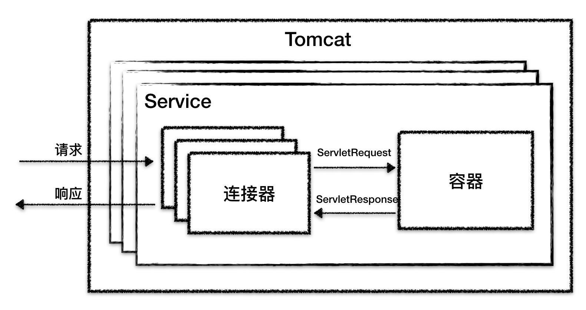

# 概览

## 1Tomcat总体架构

Tomcat需要实现的两个核心功能:

1. 处理socket连接，负责网络字节流与request和response对象的转换
2. 加载和管理Servlet，以及处理Request的请求

因此Tomcat设计了两个核心组件连接器(Connector)和容器(Container)来分别做这两件事儿。  
连接器负责对外交流，容器负责内部处理

Tomcat支持的I/O模型有以下几种:

1. NIO: 非阻塞I/O，采用Java NIO类库处理
2. NIO2: 异步I/O，采用AIO类库实现
3. APR: 采用Apache可一直运行库实现，是C/C++编写的本地库

Tomcat支持的应用层协议有:  

1. Http/1.1
2. AJP
3. Http/2

Tomcat为了实现支持多种I/O模型和应用层协议，一个容器可以对接多个连接器。但是单独的连接器或容器都不可以对外提供服务，  
需要组装起来才可以使用，组装起来之后这个叫做Service组件。注意:Service本来并没有做什么事儿，而是仅仅将连接器和容器  
整理在一起。Tomcat中可能有多个Service，这样的设计也是为了灵活性考虑，通过配置多个Service，可实现不同的端口号对应  
不同的服务



从上图可以知道最顶层就是Server，这里的Server指的就是一个Tomcat实例。一个Server中有多个Service，一个Service有多个  
连接器和一个容器。连接器和容器之间通过标准的ServletRequest和ServletResponse通信

## 2连接器

```
连接器对Servlet容器屏蔽了协议以及I/O模型等区别。无论是Http还是AJP，从容器中获取的都是一个标准的ServletRequest对象。
连接器的功能如下:
1. 监听网络端口
2. 接受网络连接请求
3. 读取请求网络字节流
4. 根据具体应用层协议解析字节流，统一生成Tomcat的Request对象
5. 将Tomcat Request对象转化为标准的ServletRequest
6. 调用Servlet容器，得到ServletResponse
7. 将Servlet Response转换为Tomcat Response
8. 将Tomcat Response转换成网络字节流
9. 将响应会写给浏览器

优秀的模块化设计应该考虑高内聚、低耦合
1. 高内聚: 相关度比较高的功能要尽可能集中，不要分散
2. 低耦合: 两个相关的模块要尽可能减少依赖的部分和降低依赖的程度，不要让两个模块产生强依赖

连接器需要完成3个高内聚的功能:
1. 网络通信
2. 应用层协议解析
3. Tomcat Request/Response和Servlet Request/Response之间的转换

因此Tomcat的设计者设计了3个组件来实现这三个功能，分别是EndPoint、Processor和Adapter

徐俊华

```