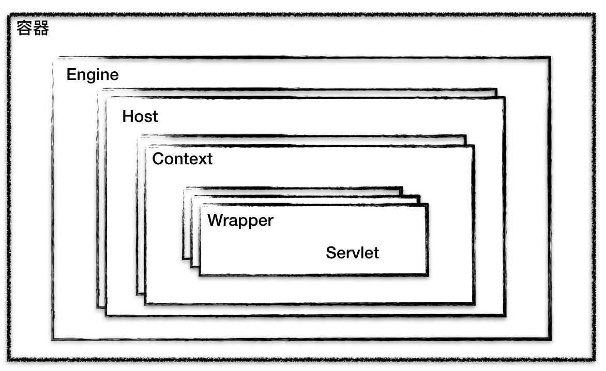
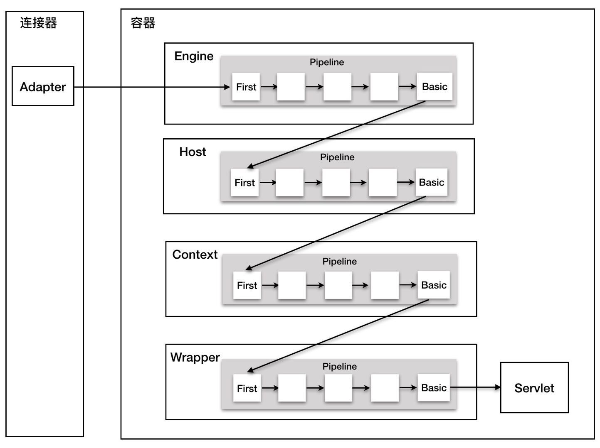

# 概览

```
容器是负责对内处理的。具体来说，容器负责处理Servlet请求
一个容器可能接入多个连接器以支持不同的协议
在Tomcat中，容器就是用于装在Servlet的，我们今天就来研究一下Tomcat和Servlet容器是如何设计的。
```

## 1容器的层次结构

> Tomcat设计了四种容器，分别是Engine、Host、Context和Wrapper。这四种容器是父子关系，如下:



```
Tomcat通过分层的设计，使得Servlet容器具有很强的灵活性
Context表示一个应用程序,Wrapper表示一个Servlet。一个应用程序中可能存在多个Servlet
Host代表一个虚拟主机(站点),可以给Tomcat配置多个主机地址，而一个虚拟主机下可以部署多个Web应用程序；
Engine表示引擎，用来管理多个虚拟站点，一个Service最多只能有一个Engine。
那么当一个请求发送时候Tomcat最终是怎么找到处理请求的Servlet的呢?
1. Adapter调用容器的Service方法来执行Servlet
2. Engine首先会拿到请求，Engine进行处理
3. Engine会将请求传递给子容器Host，Host进行处理
4. Host会将请求传递给Context容器，Context容器进行处理
5. Host容器通过web.xml中配置的Servlet找到Wrapper，最终调用Servlet来处理

以上的处理模式是责任链模式
```


```
Wrapper容器的最后一个Valve会创建一个Filter链，并调用doFilter
方法 ，最终调用Servlet的service方法。
下面是volve和Filter的区别:
1. Valve是Tomcat的私有机制，与Tomcat基础架构是紧耦合的。
Servlet API是公有的标准，所有的Web容器都支持Filter机制
2. Valve工作在Web容器级别，拦截所有应用的请求，而Servlet 
Filter工作在应用级别，只能拦截某个web应用的请求。如果想做整个容器的拦截，只能使用Valve来实现
````