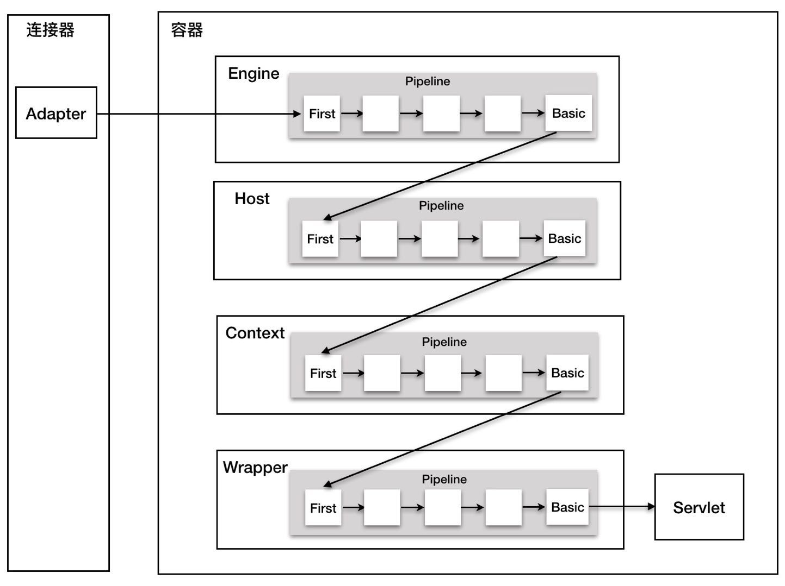

# 概览

```
通过之前的理解，我们已经知道了Tomcat的基本组件以及处理流程
下图是一个请求在Tomcat中的流转过程
```



```
那么Tomcat是怎么管理这些组件的创建、初始化、启动、停止和销毁的呢
通过分析我们发现Tomcat的组件具备两层关系:
1. 组件有大有小，大组件管理小组件，比如Server管理Service、Service管理连接器和容器
2. 组件有内有外，外层组件控制内层组件，外层组件调用内层组件完成业务功能。 也就是说，请求的处理过程是有外层组件来驱动的

以上两个特点决定了系统在创建组件时应该遵循一定的原则:
1. 先创建子组件，然后创建父组件，子组件需要被注入到父组件中
2. 先创建内组件、然后创建外组件，内组件需要被注入到外组件中
```

## 1 一键式启停: LifeCycle接口

```
设计就是要找到系统的变化点和不变点。这里的不变点就是每个组件都要
经过创建、初始化、启动等几个过程，这些状态和状态的转化是不变的。
而变化点是每个组件的初始化方法、也就是启动方法不一样

因此，Tomcat将不变点抽象出来成为一个接口，这个接口叫做LifeCycle
LifeCycle中定义了几个方法: init(),start(),stop()和destroy方法，每个具体的组件去实现这些方法。
理所当然，在父组件的init()方法中需要创建子组件并调用子组件的init
方法。同样，在父组件的start方法中需要调用子组件的start方法，这就是组合模式的使用，只需要调用顶层组件，也就是Server组件的init和start方法就可以将Tomcat整个启动起来了
```

## 2可扩展性: LifeCycle事件

```
在每个组件的具体实现方法是复杂多变的，比如在Host容器的启动方法中
需要扫描webapp下面的web应用，创建响应的Context容器，如果将来
需要增加新的逻辑，那么需要直接修改start方法吗?这样会违反开闭原则，你不能直接修改系统中已有的类，但是你可以定义新的类

我们注意到，组件的init和start调用是由他的父组件的状态变化触发
的，上层组件的初始化会触发子组件的初始化，我们将组件的生命周期
定义成一个个状态，把状态的转变看做是一个事件，而事件是有监听器
的，在监听器中可以执行一些额外的逻辑，而且监听器也可以方便的添加
和删除，这就是典型的观察者模式
```

## 3重用性:LifeCycleBase抽象类

```
在Tomcat中，生命周期事件的处理是如何进行的呢？首先我们直观的感觉
到可以每个组件撰写自己的生命周期事件就好了，但是这会造成诸多的重复代码，
那么Tomcat是怎么处理的呢?Tomcat撰写了LifecycleBase这个
抽象类，抽象类中定义了各种操作，比如init、start、stop等，然后定了操作流程，
同时在操作流程中抽象了一些抽象方法给子类实现，比如initInternal操作，这是典型的模板模式。
Tomcat就是通过这样的方式重用代码
```

## 4总结

```
Tomcat为实现一键式启停以及优雅的生命周期管理，并考虑到了可扩展性和可重用性，
将面向对象思想和设计模式发挥到极致，分别运用了组合模式、观察者模式、骨架抽象类和模板方法模式
```