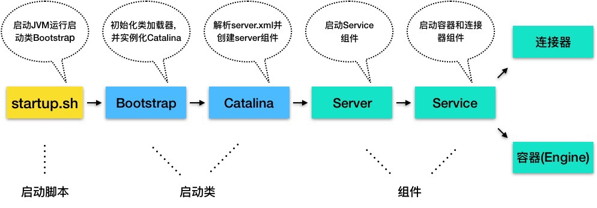

<!-- TOC -->

- [概览](#%E6%A6%82%E8%A7%88)
  - [1.Catalina](#1catalina)
  - [2Service组件](#2service%E7%BB%84%E4%BB%B6)
  - [3Engine组件](#3engine%E7%BB%84%E4%BB%B6)
  - [4总结](#4%E6%80%BB%E7%BB%93)

<!-- /TOC -->

# 概览

```
我们在使用Tomcat的时候，可以通过Tomcat目录下的startup.sh来启动Tomcat，那这个脚本究竟做了什么呢?
起流程图如下:
```



1. 因为Tomcat本来就是一个Java程序，因此startup.sh首先会启动一个JVM来运行Tomcat的启动类Bootstrap
2. BootStrap的职责是初始化Tomcat的类加载器，并且创建Catalina。
3. Catalina是一个启动类，他通过解析Server.xml、创建相应的组件，并调用Server的start方法
4. Server组件的职责就是管理连接器和顶层容器Engine，因此会调用连接器和Engine的start方法

这样Tomcat就算已经启动完成了。下面就讲解一下Tomcat启动过程中提到的几个非常关键的启动类和组件

Catalina类相当于上帝，它初始化了类加载器，也就是创造万物的工具  
如果我们将Tomcat比作一家公司，那么Catalina就是公司的创始人，因为Catalina负责创建团队，也就是创建Server以及它的子组件。

Server是公司的CEO，负责管理多个事业群，每个事业群就是一个Service

Service是事业群的总经理，它管理两个职能部门，一个是连接器，一个是容器

Engine则是研发部经理，因为Engine是最顶层的容器组件

## 1.Catalina

```
Catalina的主要任务就是创建Server，它并不是直接new一个Server实例就完事儿了，而是需要解析Server.xml,并把xml中配置的各种组件一一创建出来
接着调用Server的init方法和start方法，这样整个Tomcat就启动起来了。同时在启动时注册了Tomcat的关闭钩子，这个关闭钩子就是一个线程，JVM在关闭之前会调用线程的run方法。其实CatalinaShutdownHook执行的操作就是关闭Server
```

## 2Service组件

```
Service组件的实现类其实就是StandardService，这个类中有connectors、engine、Server等等，值得注意的是还包括MapperListener
从命名中我们就知道这个使用观察者模式实现了Tomcat的热部署
我们再看看Service组件的启动方法
1. 触发启动监听者
2. 先启动Engine，Engine会启动它自己的子组件
3. 再启动Mapper监听者
4. 最后启动连接器
```

## 3Engine组件

```
我们再来看看Engine组件具体是如何启动的。Engine本质就是一个容器，它继承了ContainerBase基类并且实现了Engine接口
Engine通过Pipeline和Valve将请求转发给子组件进行处理
```

## 4总结

```
本章学习了Tomcat的启动过程，具体是由启动类和基础组件完成的，他们都承担着”管理“的角色，负责将子组件创建出来，并把它们拼装在一起
```